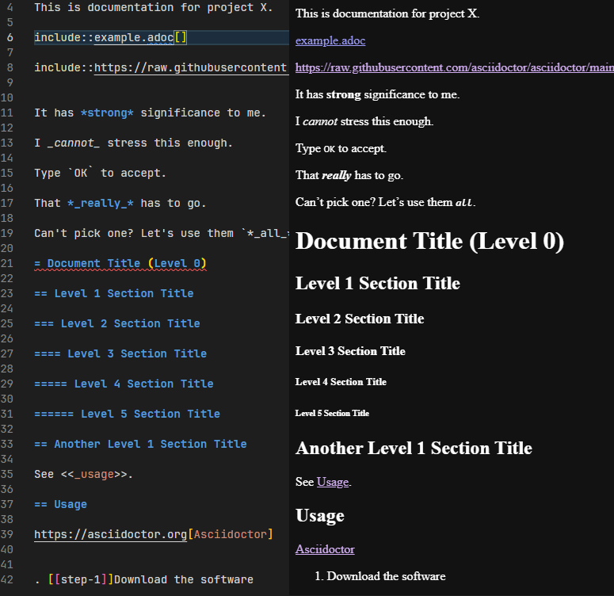

<!--
Get your module up and running quickly.

Find and replace all on all files (CMD+SHIFT+F):
- Name: nuxt-asciidoc
- Package name: nuxt-asciidoc
- Description: If you like asciidoc more than markdown, this plugin is exactly for you.
-->

# nuxt-asciidoc

[![npm version][npm-version-src]][npm-version-href]
[![npm downloads][npm-downloads-src]][npm-downloads-href]
[![License][license-src]][license-href]
[![Nuxt][nuxt-src]][nuxt-href]

If you like asciidoc more than markdown, this plugin is exactly for you.

- [✨ &nbsp;Release Notes](/CHANGELOG.md)
<!-- - [🏀 Online playground](https://stackblitz.com/github/your-org/my-module?file=playground%2Fapp.vue) -->
<!-- - [📖 &nbsp;Documentation](https://example.com) -->

## Features

<!-- Highlight some of the features your module provide here -->
- ⛰ &nbsp;It can handle .adoc and there corresponding file extensions and render them.

## Known Problems

- `include` will not include the content of another file, it will just make a link out of it. You can see it in the screenshot.

## Screenshot



## Quick Setup

1. Add `nuxt-asciidoc` dependency to your project

```bash
# Using pnpm
pnpm add -D nuxt-asciidoc

# Using yarn
yarn add --dev nuxt-asciidoc

# Using npm
npm install --save-dev nuxt-asciidoc
```

2. Add `nuxt-asciidoc` to the `modules` section, before the `@nuxt/content`  of `nuxt.config.ts`

```js
export default defineNuxtConfig({
  modules: [
    'nuxt-asciidoc',
    ...
    '@nuxt/content'
  ]
})
```

That's it! You can now use My Module in your Nuxt app ✨

## Example

view: pages/imprint.vue + corresponding content file: content/imprint.adoc
```vue
<script setup>
const { data } = await useAsyncData("imprint", () =>
  queryContent("/imprint").findOne()
);
</script>

<template>
  <main>
    <ContentDoc v-slot="{ doc }">
      <div v-html="doc.body"></div>
    </ContentDoc>
  </main>
</template>
```

## Development (npm, yarn, pnpm)

```bash
# Install dependencies
npm install

# Generate type stubs
npm run dev:prepare

# Develop with the playground
npm run dev

# Build the playground
npm run dev:build

# Run ESLint
npm run lint

# Run Vitest
npm run test
npm run test:watch

# Release new version
npm run release
```

<!-- Badges -->
[npm-version-src]: https://img.shields.io/npm/v/my-module/latest.svg?style=flat&colorA=18181B&colorB=28CF8D
[npm-version-href]: https://npmjs.com/package/my-module

[npm-downloads-src]: https://img.shields.io/npm/dm/my-module.svg?style=flat&colorA=18181B&colorB=28CF8D
[npm-downloads-href]: https://npmjs.com/package/my-module

[license-src]: https://img.shields.io/npm/l/my-module.svg?style=flat&colorA=18181B&colorB=28CF8D
[license-href]: https://npmjs.com/package/my-module

[nuxt-src]: https://img.shields.io/badge/Nuxt-18181B?logo=nuxt.js
[nuxt-href]: https://nuxt.com
